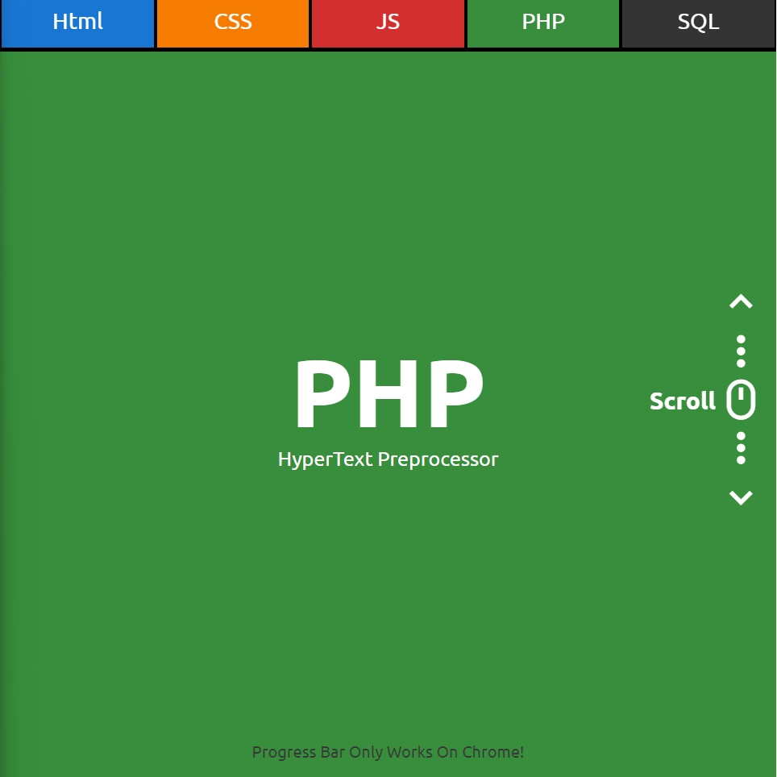

# Scroll Progress
In this tutorial ([Open in Youtube](https://youtu.be/X4vFnllZHBs)), I'm going to show you how to use modern HTML, CSS to create a completely responsive Scroll Progress Indicator. We'll be using CSS Flexbox, Media queries for our responsive design, CSS  transition for hover effect and css animations for scroll indicating, Also we have a Scroll to Element in this code!

# Screenshot
Here we have project screenshot :

# AsmrProg

We create a project each 4 days with voting on our <a href="https://youtube.com/@AsmrProg" target="_blank">Youtube</a> channel.
You can vote for upcoming projects on our channel **community** page :wink: